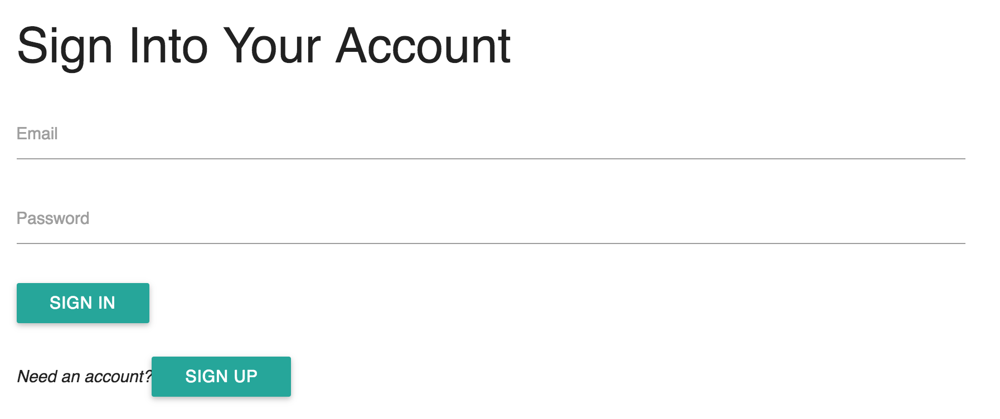
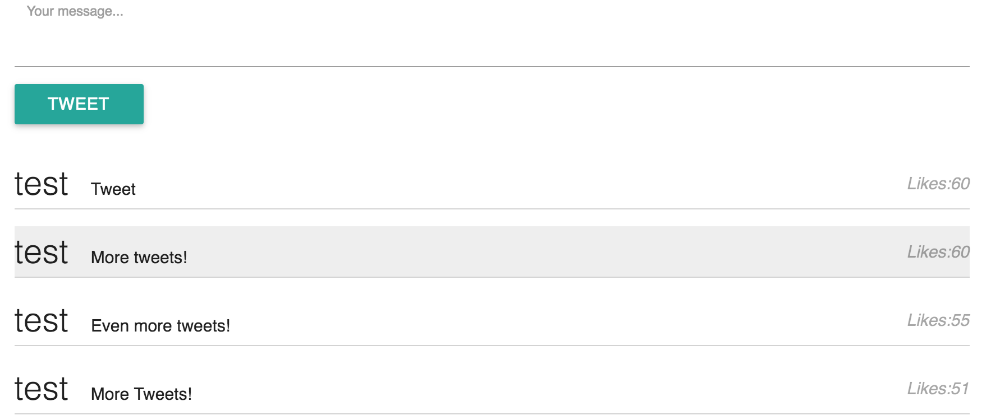

# Exercise-1
In this exercise, you'll build a (very) simple twitter-like app using React and Firebase. You'll create an authentication interface, as well as a chat interface:





Because this project was bootstrapped with [Create React App](https://github.com/facebookincubator/create-react-app), you should begin by forking/cloning this repository, then installing necessary packages:

```bash
# Make sure you're inside the exercise directory
cd exercise-1

# Install packages in package.json
npm install

# Start server
npm start
```

Then follow the instructions below to complete the exercise.

## Set up
In order to do this exercise, you'll need to **set up a firebase database** and set the **authentication** to _email + password_. Once you've done that:

- In your `Config.js` file, use the configuration from firebase to set up your app


## Authentication
There are a few pieces missing from the authentication steps. You may want to use [this old example](https://github.com/info343c-a16/m13-firebase-auth/blob/complete/exercise-1/js/authenticate.js) as a reference.

- In your `App` component (at the appropriate time), listen for a change in authentication to see if there is a user already logged in. If so, set the state (see [lines 76-91](https://github.com/info343c-a16/m13-firebase-auth/blob/complete/exercise-1/js/authenticate.js))

- In your `App` component, write an appropriate `signIn` function (it should follow a similar structure to the `signUp` function).

- In your `App` component, pass a function called `submit` (as **props**) to your `<SignUp />` and `<SignIn />` components when they're being created in the `render` function. Make sure to pass the appropriate function to each component

## Data Storage
In order to get your data storage to work, you'll need to do a few things.

- At the appropriate time in your `TweetContainer` component, create a reference to your firebase database. When there is a change to the `value` of that reference, you should **update your state** appropriately.
- In your `createTweet` function of your `TweetContainer`, push the `tweet` object into your tweet reference
- In your `likeTweet` function, use the `ref.update` method to update the `likes` property of an individual tweet
- Your `render` function currently returns a placeholder for your tweet (`<div>hello</div>`). Instead, you should return a `Tweet` component, and pass in the following properties:
    - `key`: a key for the element, which should be the _same as the firebase key_
    - `data`: some data for your tweet, which should be the _object that is stored on firebase_
    - `handleClick`: an **anonymous function** that passes the key (`d`) to your `likeTweet` function. For example: `() => functionName(d)`
